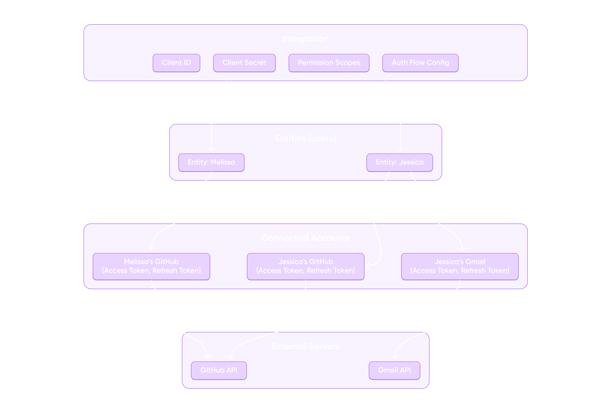

<h1 align="center" id="top">
  Composio
</h1>

<h3 align="center">
Production Ready Toolset for Building Intelligent AI Agents
</h3>

<div align="center">

</div>

## What is Composio?

**Composio is the best toolset to integrate AI Agents to best Agentic Tools and use them to accomplish tasks.**,
It supports:

- **100+ Tools**: Support for a range of different categories

  - **Software**: Do anything on GitHub, Notion, Linear, Gmail, Slack, Hubspot, Salesforce, & 90 more.
  - **OS**: Click anywhere, Type anything, Copy to Clipboard, & more.
  - **Browser**: Smart Search, Take a screenshot, MultiOn, Download, Upload, & more.
  - **Search**: Google Search, Perplexity Search, Tavily, Exa & more.
  - **SWE**: Ngrok, Database, Redis, Vercel, Git, etc.
  - **RAG**: Agentic RAG for any type of data on the fly!

- **Frameworks**: Use tools with agent frameworks like **OpenAI, Groq (OpenAI compatible), Claude, LlamaIndex, Langchain, CrewAI, Autogen, Gemini, Julep, Lyzr**, and more in a single line of code.
- **Managed Authorisation**: Supports six different auth protocols. _Access Token, Refresh token, OAuth, API Keys, JWT, and more_ abstracted out so you can focus on the building agents.
- **Accuracy**: Get _up to 40% better agentic accuracy_ in your tool calls due to better tool designs.
- **Embeddable**: Whitelabel in the backend of your applications managing Auth & Integrations for all your users & agents and maintain a consistent experience.
- **Pluggable**: Designed to be extended with additional Tools, Frameworks and Authorisation Protocols very easily.

## Getting started with Python

```shell
pip install composio-core
```

## Github Agent

```python
# Run this in the terminal
pip install composio-openai
composio login
composio add github
export OPENAI_API_KEY=sk-xxx
```
Let's start by building a simple agent that can interact with GitHub. Create a file `github_agent.py`:

```python
from composio_openai import ComposioToolSet, App
from openai import OpenAI

openai_client = OpenAI()
composio_toolset = ComposioToolSet()

tools = composio_toolset.get_tools(apps=[App.GITHUB])

task = "Star the repo composiohq/composio on GitHub"

response = openai_client.chat.completions.create(
model="gpt-4-turbo-preview",
tools=tools,
messages=
    [
        {"role": "system", "content": "You are a helpful assistant."},
        {"role": "user", "content": task},
    ],
)

result = composio_toolset.handle_tool_calls(response)
print(result)
```
### Execute the Agent
```python
python github_agent.py
```

You can find more Python examples [here](https://github.com/ComposioHQ/composio/tree/master/python/examples)


## Getting start with Javascript
```shell 
npm install composio-core
```

## Google Calendar Agent
```shell
npm install composio-core openai
export OPENAI_API_KEY=sk-xxx
export COMPOSIO_API_KEY=xxx
```
Let's start by building a simple agent that can interact with Google Calendar. Create a file `calendar_agent.js`:

```javascript
import { OpenAI } from "openai";
import { OpenAIToolSet } from "composio-core";

const toolset = new OpenAIToolSet({
    apiKey: process.env.COMPOSIO_API_KEY,
});

async function executeAgent(entityName) {
    const entity = await toolset.client.getEntity(entityName)

    const tools = await toolset.get_actions({ actions: ["GOOGLECALENDAR_QUICK_ADD"] }, entity.id);
    const date = new Date();
    const instruction = "Today's date is ${date}. Schedule an event of 1 hour tomorrow at 5:30PM"

    const client = new OpenAI({ apiKey: process.env.OPEN_AI_API_KEY })
    const response = await client.chat.completions.create({
        model: "gpt-4-turbo",
        messages: [{
            role: "user",
            content: instruction,
        }],
        tools: tools,
        tool_choice: "auto",
    })

    console.log(response.choices[0].message.tool_calls);
    await toolset.handle_tool_call(response, entity.id);
}

executeAgent("default"); 
```
### Execute the agent

```javascript
node calendar_agent.js
```
You can find more Javascript examples [here](https://github.com/ComposioHQ/composio/tree/master/js/examples)


### Managed Authentication



### Composio handles Authentication for you
1. Create an Integration for your external service (e.g., GitHub OAuth configuration)
2. Users (Entities) use this Integration to connect their accounts
3. Each successful connection creates a Connected Account
4. Your application uses Connected Accounts to make authenticated requests
5. You can also whitelabel the OAuth Developer app that is shown to the user when he initiates the connection

## Getting Help

- Read the docs at [docs.composio.dev](https://docs.composio.dev)
- Join our [Discord community](https://dub.composio.dev/JoinHQ)
- Follow us on [Twitter](https://twitter.com/composiohq)
- Subscribe to our [YouTube channel](https://www.youtube.com/@Composio)

## Star History

[](https://star-history.com/#composiohq/composio&Date)


## 🤗 Contributions

Composio is open-source and we welcome contributions. Please fork the repository, create a new branch for your feature, add your feature or improvement, and send a pull request.

Also go through our [Contribution Guidelines](https://github.com/composiodev/composio/blob/master/CONTRIBUTING.md) and [Code of Conduct](https://github.com/composiodev/composio/blob/master/CODE_OF_CONDUCT.md) before you start.

## 🔗 Links

- [Home page](https://composio.dev?utm_campaign=github-readme)
- [Contribution Guidelines](https://github.com/composiodev/composio/blob/master/CONTRIBUTING.md)
- [Docs](https://docs.composio.dev/?utm_campaign=github-readme)

## 🛡️ License

Composio is licensed under the Elastic License - see the [LICENSE](https://github.com/composiodev/composio/blob/master/LICENSE) file for details.

## 💪 Thanks To All Contributors

<a href="https://github.com/composiohq/composio/graphs/contributors">
  
</a>
